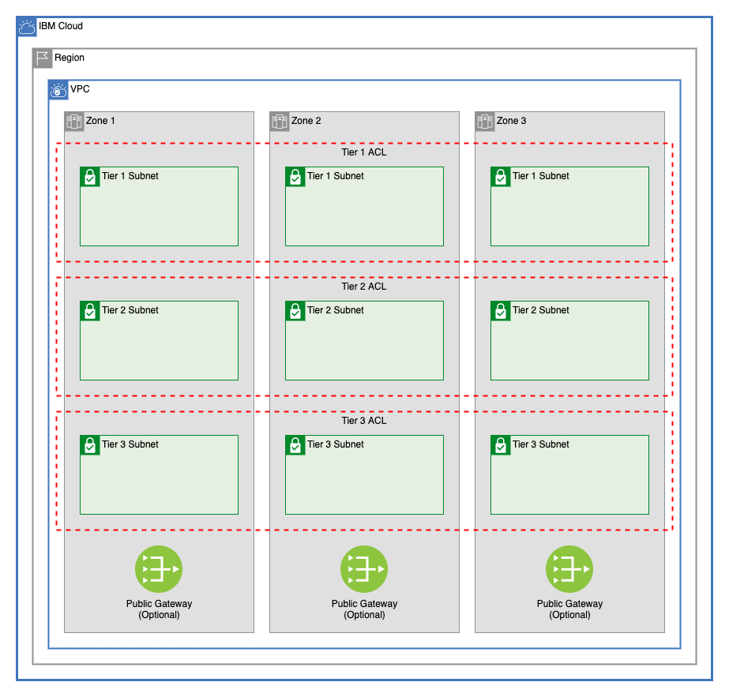

# GCAT Multitier VPC

This module creates a VPC with any number of tiers of subnets across 1, 2, or 3 zones, network ACLs, and optionally creates public gateways in those zones.



---

## Table of Contents

1. [VPC](##vpc)
2. [Public Gateways](##public-gateways)
3. [Network ACLs](##network-acl)
   - [Dynamic Network Connection Rules](###dynamic-network-connection-rules)
4. [Subnet Tiers](##subnet-tiers)
5. [Module Variables](##Module-Variables)
6. [Module Outputs](##Module-Outputs)
7. [As A Module in a Larger Architecture](##As-A-Module-in-a-Larger-Architecture)

---

## VPC

This module creates a VPC in a resource group with optional Classic Access. It also allows users to update the default vpc security group with additional rules.

### Default Security Group Rules

Default security group rules are converted from a list to an object to ensure that adding, deleting, or changing the order of rules listed will not force unwanted changes. Example:

```terraform
ibm_is_security_group_rule.default_vpc_rule["allow-inbound-ping"]
ibm_is_security_group_rule.default_vpc_rule["allow-inbound-ssh"]
```

---

## Public Gateways

This module allows a user to optionally create public gateways in the VPC in each of the three zones of the VPC's region. Example addresses when creating all three gateways:

```terraform
ibm_is_public_gateway.gateway["zone-1"]
ibm_is_public_gateway.gateway["zone-2"]
ibm_is_public_gateway.gateway["zone-3"]
```

---

## Network ACLs

This module creates any number of ACLs. These ACLs can be attached to any number of subnet tiers. Each ACL must include at least one rule.

### Dynamic Network Connection Rules

Each ACL object in the `network_acls` variable can use a field called `network_connections`. By entering the names of other tiers, this will dynamically generate rules that will allow both inbound and outbound traffic for CIDR blocks in that other tier.

#### Connection Example

In [variables.tf](variables.tf) the following ACL is created as the default in the `network_acls` variable:

```terraform
    { 
      name                = "db-tier-acl"
      network_connections = ["app-tier"] 
      rules               = [
        {
          name        = "deny-all-inbound"
          action      = "deny"
          direction   = "inbound"
          destination = "0.0.0.0/0"
          source      = "0.0.0.0/0"
        }
      ]
    }
```

In [variables.tf](variables.tf), this is the subnet tier `app-tier` declared in the `subnet_tiers` variable

```terraform
    {
      name     = "app-tier"
      acl_name = "app-tier-acl"
      subnets  = {
        zone-1 = [
          {
            name           = "subnet-a"
            cidr           = "10.40.10.0/24"
            public_gateway = false
          }
        ],
        zone-2 = [
          {
            name           = "subnet-b"
            cidr           = "10.50.10.0/24"
            public_gateway = false
          }
        ],
        zone-3 = [
          {
            name           = "subnet-c"
            cidr           = "10.60.10.0/24"
            public_gateway = false
          }
        ]
      }
    },
```

This results in the creation of the following ACL that includes rules to allow inbound traffic from and outbound traffic to each of the subnets in `app-tier`:

```terraform
resource "ibm_is_network_acl" "multitier_acl" {
    # ...

    rules {
        action      = "allow"
        destination = "0.0.0.0/0"
        direction   = "inbound"
        id          = "69074d80-c67f-463b-ba94-96a1656d69de"
        ip_version  = "ipv4"
        name        = "allow-inbound-gcat-multizone-app-tier-subnet-a"
        source      = "10.40.10.0/24"
        subnets     = 0
    }
    rules {
        action      = "allow"
        destination = "10.40.10.0/24"
        direction   = "outbound"
        id          = "6808b3db-4ff8-43c4-a7ef-5917a86777ad"
        ip_version  = "ipv4"
        name        = "allow-outbound-gcat-multizone-app-tier-subnet-a"
        source      = "0.0.0.0/0"
        subnets     = 0
    }
    rules {
        action      = "allow"
        destination = "0.0.0.0/0"
        direction   = "inbound"
        id          = "fa0c7adf-3529-40cd-b580-874ff333b36a"
        ip_version  = "ipv4"
        name        = "allow-inbound-gcat-multizone-app-tier-subnet-b"
        source      = "10.50.10.0/24"
        subnets     = 0
    }
    rules {
        action      = "allow"
        destination = "10.50.10.0/24"
        direction   = "outbound"
        id          = "5e2e0a36-ad2b-4a13-a87f-0281ae5d04a6"
        ip_version  = "ipv4"
        name        = "allow-outbound-gcat-multizone-app-tier-subnet-b"
        source      = "0.0.0.0/0"
        subnets     = 0
    }
    rules {
        action      = "allow"
        destination = "0.0.0.0/0"
        direction   = "inbound"
        id          = "32f322b0-1cf1-40ad-bc4e-fe900d916539"
        ip_version  = "ipv4"
        name        = "allow-inbound-gcat-multizone-app-tier-subnet-c"
        source      = "10.60.10.0/24"
        subnets     = 0
    }
    rules {
        action      = "allow"
        destination = "10.60.10.0/24"
        direction   = "outbound"
        id          = "c94a7520-95b8-446c-8189-6d7e882ccfb3"
        ip_version  = "ipv4"
        name        = "allow-outbound-gcat-multizone-app-tier-subnet-c"
        source      = "0.0.0.0/0"
        subnets     = 0
    }
    rules {
        action      = "deny"
        destination = "0.0.0.0/0"
        direction   = "inbound"
        id          = "d0af35e8-36b7-4a36-a1d6-5e854cc630d5"
        ip_version  = "ipv4"
        name        = "deny-all-inbound"
        source      = "0.0.0.0/0"
        subnets     = 0
    }
}
```

## Subnet Tiers

This module allows users to create subnets across any number of tiers across 1, 2, or 3 zones. Each tier can have any number of subnets. The default for this module creates three tiers, each with one subnet in each zone.

For the `acl_name` field, use only names of ACLs defined in the `network_acls` variables.

The type of the `subnet_tiers` variable is as follows:

```terraform
list(
    object({
      name     = string
      acl_name = string
      subnets  = object({
        zone-1 = list(
          object({
            name           = string
            cidr           = string
            public_gateway = optional(bool)
          })
        )
        zone-2 = list(
          object({
            name           = string
            cidr           = string
            public_gateway = optional(bool)
          })
        )
        zone-3 = list(
          object({
            name           = string
            cidr           = string
            public_gateway = optional(bool)
          })
        )
      })
    })
  )
```

Dynamic addresses are created for each subnet by name to ensure that modifying these lists will not result in unexpected changes to your existing infrastructure:

```terraform
module.subnets.ibm_is_subnet.subnet["gcat-multizone-web-tier-subnet-a"]
module.subnets.ibm_is_subnet.subnet["gcat-multizone-web-tier-subnet-b"]
module.subnets.ibm_is_subnet.subnet["gcat-multizone-web-tier-subnet-c"]
module.subnets.ibm_is_subnet.subnet["gcat-multizone-app-tier-subnet-a"]
module.subnets.ibm_is_subnet.subnet["gcat-multizone-app-tier-subnet-b"]
module.subnets.ibm_is_subnet.subnet["gcat-multizone-app-tier-subnet-c"]
module.subnets.ibm_is_subnet.subnet["gcat-multizone-db-tier-subnet-a"]
module.subnets.ibm_is_subnet.subnet["gcat-multizone-db-tier-subnet-b"]
module.subnets.ibm_is_subnet.subnet["gcat-multizone-db-tier-subnet-c"]
module.subnets.ibm_is_vpc_address_prefix.subnet_prefix["gcat-multizone-web-tier-subnet-a"]
module.subnets.ibm_is_vpc_address_prefix.subnet_prefix["gcat-multizone-web-tier-subnet-b"]
module.subnets.ibm_is_vpc_address_prefix.subnet_prefix["gcat-multizone-web-tier-subnet-c"]
module.subnets.ibm_is_vpc_address_prefix.subnet_prefix["gcat-multizone-app-tier-subnet-a"]
module.subnets.ibm_is_vpc_address_prefix.subnet_prefix["gcat-multizone-app-tier-subnet-b"]
module.subnets.ibm_is_vpc_address_prefix.subnet_prefix["gcat-multizone-app-tier-subnet-c"]
module.subnets.ibm_is_vpc_address_prefix.subnet_prefix["gcat-multizone-db-tier-subnet-a"]
module.subnets.ibm_is_vpc_address_prefix.subnet_prefix["gcat-multizone-db-tier-subnet-b"]
module.subnets.ibm_is_vpc_address_prefix.subnet_prefix["gcat-multizone-db-tier-subnet-c"]
```

### Address Prefixes

A CIDR block is created in the VPC for each subnet that will be provisioned


---

## Module Variables

Name                 | Type                                                                                                                                                                                                                                                                                                                                                                                                                                                                                                                                                                                                    | Description                                                                                                                                                                                                                                                                                                                                                                     | Sensitive | Default
-------------------- | ------------------------------------------------------------------------------------------------------------------------------------------------------------------------------------------------------------------------------------------------------------------------------------------------------------------------------------------------------------------------------------------------------------------------------------------------------------------------------------------------------------------------------------------------------------------------------------------------------- | ------------------------------------------------------------------------------------------------------------------------------------------------------------------------------------------------------------------------------------------------------------------------------------------------------------------------------------------------------------------------------- | --------- | -----------------------------------------------------------------------------------------------------------------------------------------------------------------------------------------------------------------------------------------------------------------------------------------------------------------------------------------------------------------------------------------------------------------------------------------------------------------------------------------------------------------------------------------------------------------------------------------------------------------------------------------------------------------------------------------------------------------------------------------------------------------------------------------------------------------------------------------------------------------------------------------------------------------------------------------------------------------------------------------------------------------------------------------------------------------------------------------------------------------------------------------------------------------------------------------------------
ibmcloud_api_key     | string                                                                                                                                                                                                                                                                                                                                                                                                                                                                                                                                                                                                  | The IBM Cloud platform API key needed to deploy IAM enabled resources                                                                                                                                                                                                                                                                                                           | true      | 
TF_VERSION           | string                                                                                                                                                                                                                                                                                                                                                                                                                                                                                                                                                                                                     | The version of the Terraform engine that's used in the Schematics workspace.                                                                                                                                                                                                                                                                                                    |           | 1.0
prefix               | string                                                                                                                                                                                                                                                                                                                                                                                                                                                                                                                                                                                                  | A unique identifier need to provision resources. Must begin with a letter                                                                                                                                                                                                                                                                                                       |           | gcat-multizone
region               | string                                                                                                                                                                                                                                                                                                                                                                                                                                                                                                                                                                                                  | Region where VPC will be created                                                                                                                                                                                                                                                                                                                                                |           | us-south
resource_group       | string                                                                                                                                                                                                                                                                                                                                                                                                                                                                                                                                                                                                  | Name of resource group where all infrastructure will be provisioned                                                                                                                                                                                                                                                                                                             |           | asset-development
classic_access       | bool                                                                                                                                                                                                                                                                                                                                                                                                                                                                                                                                                                                                    | Enable VPC Classic Access. Note: only one VPC per region can have classic access                                                                                                                                                                                                                                                                                                |           | false
subnet_tiers         | list( object({ name = string acl_name = string subnets = object({ zone-1 = list( object({ name = string cidr = string public_gateway = optional(bool) }) ) zone-2 = list( object({ name = string cidr = string public_gateway = optional(bool) }) ) zone-3 = list( object({ name = string cidr = string public_gateway = optional(bool) }) ) }) }) )                                                                                                                                                                                                                                                    | List of subnets tiers for the vpc.                                                                                                                                                                                                                                                                                                                                              |           | [<br>{<br>name = "web-tier"<br>acl_name = "web-tier-acl"<br>subnets = {<br>zone-1 = [<br>{<br>name = "subnet-a"<br>cidr = "10.10.10.0/24"<br>public_gateway = true<br>}<br>],<br>zone-2 = [<br>{<br>name = "subnet-b"<br>cidr = "10.20.10.0/24"<br>public_gateway = true<br>}<br>],<br>zone-3 = [<br>{<br>name = "subnet-c"<br>cidr = "10.30.10.0/24"<br>public_gateway = true<br>}<br>]<br>}<br>},<br>{<br>name = "app-tier"<br>acl_name = "app-tier-acl"<br>subnets = {<br>zone-1 = [<br>{<br>name = "subnet-a"<br>cidr = "10.40.10.0/24"<br>public_gateway = false<br>}<br>],<br>zone-2 = [<br>{<br>name = "subnet-b"<br>cidr = "10.50.10.0/24"<br>public_gateway = false<br>}<br>],<br>zone-3 = [<br>{<br>name = "subnet-c"<br>cidr = "10.60.10.0/24"<br>public_gateway = false<br>}<br>]<br>}<br>},<br>{<br>name = "db-tier"<br>acl_name = "db-tier-acl"<br>subnets = {<br>zone-1 = [<br>{<br>name = "subnet-a"<br>cidr = "10.70.10.0/24"<br>public_gateway = false<br>}<br>],<br>zone-2 = [<br>{<br>name = "subnet-b"<br>cidr = "10.80.10.0/24"<br>public_gateway = false<br>}<br>],<br>zone-3 = [<br>{<br>name = "subnet-c"<br>cidr = "10.90.10.0/24"<br>public_gateway = false<br>}<br>]<br>}<br>}<br>]
use_public_gateways  | object({ zone-1 = optional(bool) zone-2 = optional(bool) zone-3 = optional(bool) })                                                                                                                                                                                                                                                                                                                                                                                                                                                                                                                     | Create a public gateway in any of the three zones with `true`.                                                                                                                                                                                                                                                                                                                  |           | {<br>zone-1 = true<br>zone-2 = true<br>zone-3 = true<br>}
network_acls         | list( object({ name = string network_connections = optional(list(string)) rules = list( object({ name = string action = string destination = string direction = string source = string tcp = optional( object({ port_max = optional(number) port_min = optional(number) source_port_max = optional(number) source_port_min = optional(number) }) ) udp = optional( object({ port_max = optional(number) port_min = optional(number) source_port_max = optional(number) source_port_min = optional(number) }) ) icmp = optional( object({ type = optional(number) code = optional(number) }) ) }) ) }) ) | List of ACLs to create. Rules can be automatically created to allow inbound and outbound traffic from a VPC tier by adding the name of that tier to the `network_connections` list. Rules automatically generated by these network connections will be added at the beginning of a list, and will be web-tierlied to traffic first. At least one rule must be provided for each ACL. |           | [<br>{<br>name = "web-tier-acl"<br>network_connections = ["app-tier"]<br>rules = [<br>{<br>name = "allow-all-inbound"<br>action = "allow"<br>direction = "inbound"<br>destination = "0.0.0.0/0"<br>source = "0.0.0.0/0"<br>},<br>{<br>name = "allow-all-outbound"<br>action = "allow"<br>direction = "outbound"<br>destination = "0.0.0.0/0"<br>source = "0.0.0.0/0"<br>}<br>]<br>},<br>{<br>name = "app-tier-acl"<br>network_connections = ["web-tier",<br>"db-tier"]<br>rules = [<br>{<br>name = "deny-all-inbound"<br>action = "deny"<br>direction = "inbound"<br>destination = "0.0.0.0/0"<br>source = "0.0.0.0/0"<br>}<br>]<br>},<br>{<br>name = "db-tier-acl"<br>network_connections = ["app-tier"]<br>rules = [<br>{<br>name = "deny-all-inbound"<br>action = "deny"<br>direction = "inbound"<br>destination = "0.0.0.0/0"<br>source = "0.0.0.0/0"<br>}<br>]<br>}<br>]
security_group_rules | list( object({ name = string direction = string remote = string tcp = optional( object({ port_max = optional(number) port_min = optional(number) }) ) udp = optional( object({ port_max = optional(number) port_min = optional(number) }) ) icmp = optional( object({ type = optional(number) code = optional(number) }) ) }) )                                                                                                                                                                                                                                                                         | A list of security group rules to be added to the default vpc security group                                                                                                                                                                                                                                                                                                    |           | [<br>{<br>name = "allow-inbound-ping"<br>direction = "inbound"<br>remote = "0.0.0.0/0"<br>icmp = {<br>type = 8<br>}<br>},<br>{<br>name = "allow-inbound-ssh"<br>direction = "inbound"<br>remote = "0.0.0.0/0"<br>tcp = {<br>port_min = 22<br>port_max = 22<br>}<br>},<br>]

---

## Module Outputs

Name               | Description                                                 | Value
------------------ | ----------------------------------------------------------- | --------------------------------------------------------------------------------------------------------
vpc_id             | ID of VPC created                                           | ibm_is_vpc.vpc.id
acls               | ID of ACL created for subnets                               | [ for network_acl in ibm_is_network_acl.multitier_acl: { name = network_acl.name id = network_acl.id } ]
public_gateways    | Public gateways created                                     | local.public_gateways
subnet_ids         | The IDs of the subnets                                      | module.subnets.ids
subnet_detail_list | A list of subnets containing names, CIDR blocks, and zones. | module.subnets.detail_list
subnet_zone_list   | A list containing subnet IDs and subnet zones               | module.subnets.zone_list

---

## As a Module in a Larger Architecture

```terraform
module multitier_vpc {
  source               = "./multitier_vpc"
  prefix               = var.prefix
  region               = var.region
  resource_group       = var.resource_group
  classic_access       = var.classic_access
  subnet_tiers         = var.subnet_tiers
  use_public_gateways  = var.use_public_gateways
  network_acls         = var.network_acls
  security_group_rules = var.security_group_rules
}
```
